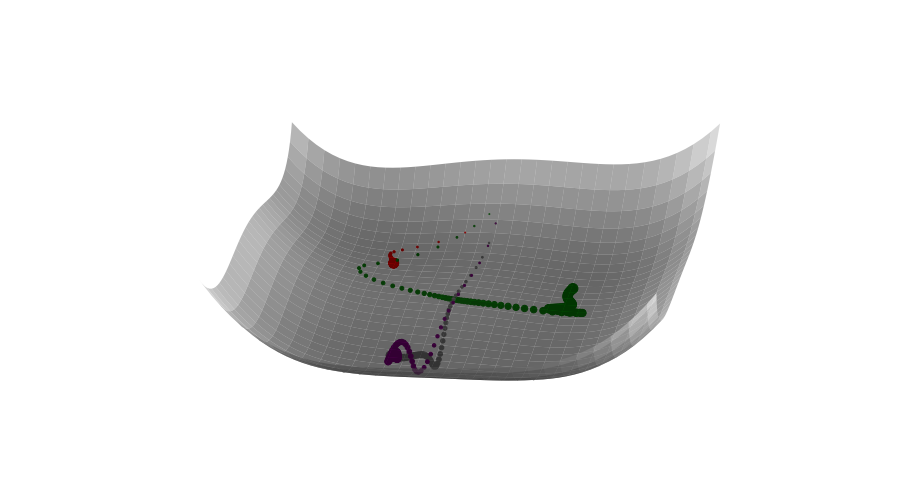
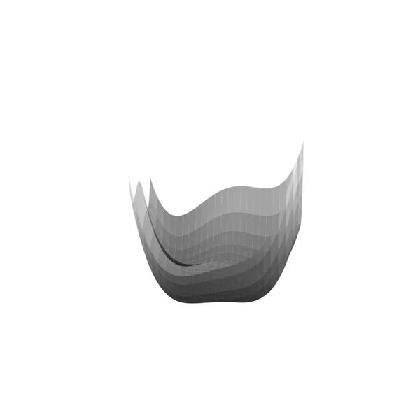

# Optimizers Visualized

Visualizing learning steps on 2D spaces and 3D Surfaces.  

A 3D Example:  

    # 3d surface
    from spaces.twoD import SGDVisOneVariable
    
    # test functions
    from spaces.threeD import State
    
    state = State(space_lim_min=-7, space_lim_max=7,
              x_initial=-6, y_initial=0,
              test_function='himmelblau', 
              iteration=128)
    
    steps_standard = h.run_gd(epsilon = 0.001, alpha = 0.9, nesterov=False)
    steps_nesterov = h.run_gd(epsilon = 0.001, alpha = 0.9, nesterov=True)
    steps_adam = h.run_adam(epsilon=0.01)
    steps_adagrad = h.run_adagrad(epsilon = 1)
    

Available Test functions: `himmelblau`, `parabolic`, `matyas`, `saddle`  

Creating a GIF:
Steps:

1. Plotting and storing each iteration in the `frames` directory and creating a video with `ffmpeg` library.  
2. Generate GIF from video with the `ffmpeg`.  

Plotting frames:

    ITERS=120
    for i in range(ITERS):
        file_path = 'frames/plot_{0:03}.png'.format(i)
        fig = h.plot_steps([steps_standard],
                           steps_until_n=i,
                           azimuth=5+5*math.log(i+1),
                           elevation = 20+5*math.log(i+1),
                           color_map = cm.gray, n_back = 20,
                           plot_title = 'Gradient Descent with Momentum',
                           colors = ['gray', 'red']
                          )
        fig.savefig(file_path)

Creating Video:  

    video = Video(dir_to_save='frames', video_name=FILE_NAME_WO_EXTENSION, frame_rate = 29)
    cmd_video = video.get_fmpeg_video_cmd()
    os.system(cmd_video)
    
    video
    
    gif = GIFfromMP4Video(file_name=FILE_NAME_WO_EXTENSION, dir_to_save = '', frame_rate = 29)
    cmd_gif = gif.get_fmpeg_gif_cmd()
    os.system(cmd_gif)

